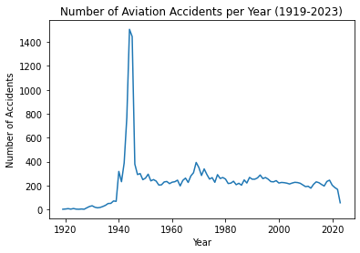
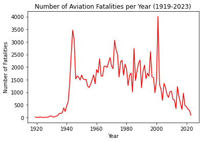
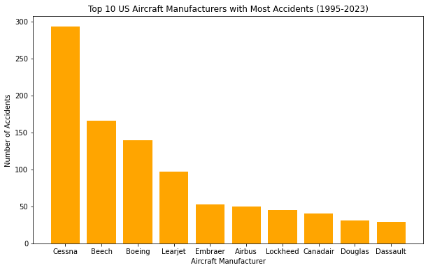

# AVIATION ACCIDENT ANALYSIS SINCE 1919-2023

## **OVERVIEW**
The global aerospace sector relies on a foundation of uncompromising safety enhancement, driven by the logical analysis of past incidents. The dataset (aviation-accident-data-2023.05.16.csv), containing over 23,950 records, forms a core basis for such analysis. Through examination of such past events, we are then able to move beyond simple accident counting to establishing root causes, evaluating individual aircraft model and manufacturer safety performance, and identifying high-risk operating stages. The rational process translates raw facts into actionable intelligence that can be directly applied to strategic plans for new market entrants—such as fleet acquisition and safety procedure implementation—in an effort to build a competitive and resilient aviation operation.

## **Business Understanding**
From the above problem I deduced that the company plans to enter the aviation industry but lacks sufficient knowledge about aircraft operations,accident histories and manufacture reliability.Thus my analysis focuses on understanding the most common causes of accidents, highlighting aircraft shortcomings and evaluating the safety records of different manufacturers.This will enable the company to minimizs risk, select the most reliable aircrafts and build a strong foundation in the aviation industry.

In order to attain this, the following Business questions were formulated:
* Which aircraft types majorly contributed to aircraft accident and which didnt?
* What are the most profitable aircraft types notwithstanding the accident frequency and based on them too?
* In what way are the accidents trending over time and under what periods are there influxes?

## *Data Understanding and analysis*

### Source of Data
In the data folder is a datasets Link to an external site (https://www.kaggle.com/datasets/drealbash/aviation-accident-from-1919-2023/data) from the National Transportation Safety Board that includes aviation accident data from 1919 to 2023 about civil aviation accidents and selected incidents in the United States and international waters.

### Data Description

MY data contains the dataset: 'aviation-accident-data-2023-05-16.csv'

It has a size of 23,967 rows by 9 columns.

The Key columns include:

* Date - Date of accident.

* Year - Accident year .

* Type - The model of the aicraft.

* Operator - Airline /type of operator involved.

* Location - Place of accident.

* Country - Country of occurrence.

* Fatalities - Number of casualties  though some maybe missing.

* Category(Cat) - The type of fatalities

* Registration - The validation/documentation of the aircraft.

### Visualizations
After my thorough cleaning,the outcome was this cleaned dataset;(cleaned_aviation_data.csv).However, scrutnizing the tabular structure would render to be tiresome thus the need for visualizations to summarise the key insights in our data.This makes it easier to convey various findings on accident frequency, their impact over the years and other key dimensions.

* ### Analysis on Number of accidents over time

Thus over this time period we can deduce that the number of accidents were higher between 1939-1945 majorly due to the world war.

* ### Analysis on Number of Fatalities over time

This evidently proves that the steep increase in fatalities between 1920s-1940s is heavily influenced by WWII and the general decline from the 1990s onwards indicates improvements in aviation safety.

 This led to me wanting to figure out which US aircrafts have the most accidents.

* ### Analysis on the top US Aircraft Manufactureres with the most Accidents

This clearly outlines that the newer manufacturers:Cessna has a higher accident count due to its newer inception unlike the Doglas and Dassaults which were used during the WW.

## CONCLUSION
Based on my findings, there was a high accident rate between 1939-1945 majorly due to World War II (WWII).
This is also backed up by the high number of accidents by the USSAF and USAF operators majorly because they took part in the world war.
Accidents and fatalities in aviation have decreased over time thanks to new technology and better safety standards. This makes the industry less risky and more profitable for companies to enter.

The company should avoid Douglas aircraft, as they have historically had the highest accident rates. While all models carry some risk, the Douglas is especially unsafe, partly because it was originally built for war and only later adapted for commercial use.Douglas planes also show higher fatality numbers because they carry more passengers as commercial airliners. By contrast, private operators face lower risks, which benefits the company’s plan.

Finally, while some regions like the USA and Russia show higher accident rates, this is influenced by war and other external factors. The company should balance geography, profitability, and safety when choosing the best low-risk aircraft.